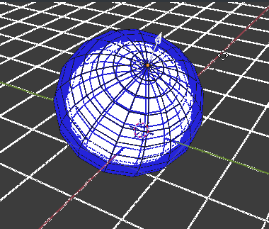
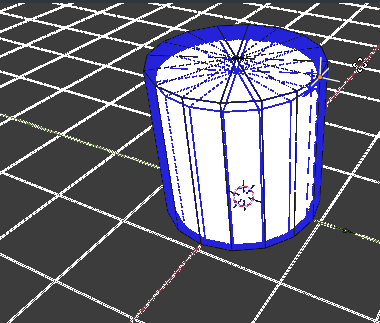
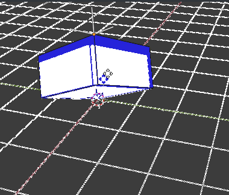

# Blender 4 Engineers (B4NGN)
		
## Simple and non-invasive add-on for parametric primitives in Blender

This Blender add-on provides easily-accessible shortcuts for parametric geometrical primitives in the already-existing Shift+A menu (exactly where they so obviously belong) No extra buttons, no extra internal-features, no state logic stored in the .blend files themselves. The parametric primitives are implemented using already-existing blender features, and thus completley manually-editable and compatible even when this add-on is absent.

## Features

As of now, three parametric primmitive types are supported:

* Sphere 
* Cylinder 
* Cuboid 

## Installation
	
In order to install, simply download the `B4NGN.py` file to your computer, and use Blender's internal add-on installation utility:
Click `Edit`>`Prefferences`, go to the `Add-ons` tab and click the `Install` button on the top right. This will open Blender's built-in file manager. Simply navigate to the path where you downloaded the file on your computer, select it and press the `Install` button. _It **really** is **that** easy !_

## Usage

This add-on adds parametric objects which can be edited non-destructively.

### Adding an object

The addition parametric geometric primitives is implemented as a set of blender `Operators`. By default, there is no shortcut assigned, so you will have to hit `F3` on your keyboard to bring up a searchbox, in which you should type `Add par...` and the following 3 results will show up:
* `Add parametric Sphere`
* `Add parametric Cylinder`
* `Add parametic Cuboid`
	
Highlighting one of them and hitting `ENTER` will execute the operator, and add the corresponding parametric primitive to your blender scene.

### Manipulating added objects

Each parametric primitive has **control points** which define it's geometry. 
Simply manipulating the position in space of the control point changes the corresponding object's geometry. This is a completley non-destructive process. You can always come back to that object and change it's shape. 

#### Sphere
	
The sphere has a control point with one degree of freedom: moving it further from the sphere origin increases the radius.

#### Cylinder

The cylinder has a control point with two degrees of freedom: moving it horizontally away from the origin increases it's radius, and moving it vertically changes the cylinder's height

#### Cuboid

The cuboid object has a control point with 3 degrees of freedom. It defines the opposite corner of the cuboid in local carthesian coordinates
