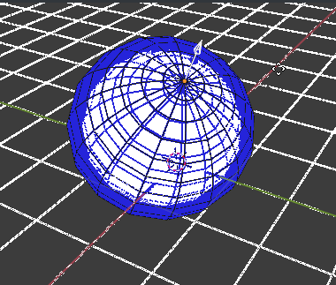

# Blender 4 Engineers (B4NGN)

### Lazăr Mihai & Abrudan Alexander

## Simple and non-invasive add-on for parametric primitives in Blender

This Blender add-on provides easily-accessible shortcuts for parametric geometrical primitives in the already-existing Shift+A menu (exactly where they so obviously belong) No extra buttons, no extra internal-features, no state logic stored in the .blend files themselves. The parametric primitives are implemented using already-existing blender features, and thus completley manually-editable and compatible even when this add-on is absent.

## Features

As of now, three parametric primitive types are supported:

Sphere  Cylinder  Cuboid 

## Installation
In order to install, simply download the `B4NGN.py` file to your computer, and use Blender's internal add-on installation utility:
Click `Edit`>`Prefferences`, go to the `Add-ons` tab and click the `Install` button on the top right. 


This will open Blender's built-in file manager. Simply navigate to the path where you downloaded the file on your computer, select it and press the `Install` button. 


_It **really** is **that** easy !_

## Usage

This add-on adds parametric objects which can be edited non-destructively.

### Adding an object

The addition parametric geometric primitives is implemented as a set of blender `Operators`. By default, there is no shortcut assigned, so you will have to hit `F3` on your keyboard to bring up a searchbox, in which you should type `Add par...` and the following 3 results will show up:
* `Add parametric Sphere`
* `Add parametric Cylinder`
* `Add parametic Cuboid`
	
Highlighting one of them and hitting `ENTER` will execute the operator, and add the corresponding parametric primitive to your blender scene.

### Manipulating added objects

Each parametric primitive has **control points** which define it's geometry. 
Simply manipulating the position in space of the control point changes the corresponding object's geometry. This is a completley non-destructive process. You can always come back to that object and change it's shape. 

#### Sphere
	
The sphere has a control point with one degree of freedom: moving it further from the sphere origin increases the radius.

#### Cylinder

The cylinder has a control point with two degrees of freedom: moving it horizontally away from the origin increases it's radius, and moving it vertically changes the cylinder's height

#### Cuboid

The cuboid object has a control point with 3 degrees of freedom. It defines the opposite corner of the cuboid in local carthesian coordinates

## Explanation

This project was created using Blender's built-in python scripting and add-on development enviornment.


In Blender's architecture, an add-on is simply a python module that uses blender's python API. It can be loaded at runtime from a plain `.py` file. It can then be activated and deactivated as the user needs it. 

### code structure

#### boilerplate and manifests

The python file begins with a short manifest containing some basic info such as the add-on's name, the category and the oldest version of Blender with which it is compatible.
```python
bl_info = {
    "name": "B4NGN",
    "blender": (2, 80, 0),
    "category": "Add_Mesh",
}
```

Then what follows is importing the required python libraries: `import bpy` (imports the blender API), `import numpy` contains tools for basic math operations, etc ...
```python
import bpy
import math
from bpy.types import Operator
from mathutils import Vector
from bpy_extras import object_utils
```

#### The operators

We then jump right into it: we define our operators as classes. The current version of the add-on has 3 types of geometric entities, therefore 3 operators, and hence, 3 classes:
* `ParametricSphere`
* `ParametricCylinder`
* `ParametricCuboid`

##### The ParametricSphere operator

We will go into more detail on this first and simplest operator:

A blender operator needs to be declared as a python class, and have some basic information regarding it's name, id and tooltip, as well as it's possible options:
```python
class ParametricSphere(Operator):
    """Adds a parametric sphere object"""           # Use this as a tooltip for menu items and buttons.
    bl_idname   = "object.add_parametric_sphere"      # Unique identifier for buttons and menu items to reference.
    bl_label    = "Add parametric Sphere"              # Display name in the interface.
    bl_options  = {'REGISTER', 'UNDO'}               # Enable undo for the operator.
```

A blender operator has one main function called `execute()`. Rather unsurpsisingly, this is the function that is called the moment a user executes the operator. Inside this function we **add a mesh object**, populate it with a single **vertex** at coodrinates (0,0,1), placing it exactly one unit above the object origin. The reasoning for this will become apparent shortly. 
```python
    def execute(self, context):                     # execute() is called when running the operator.
        mesh = bpy.data.meshes.new("Sphere")
        mesh.from_pydata([(0.0, 0.0, 1.0)],[],[])
        mesh.validate()
        object_utils.object_data_add(context, mesh, operator=None)
        obj = context.object
```

We now add an empty object (an Empty object in Blender is an object which has no geometry and is used solely for marking coordinates in 3D space) in the same place in space as the vertex we've just added and use a **Hook modifier** in order to make the vertex follow the Empty's location in space.

```python
        vx = obj.data.vertices[0]		# get location of vertex
        bpy.ops.object.empty_add(		# add empry at that location
            location=obj.matrix_world @ vx.co
            )
        p_radius = context.object
        p_radius.parent = obj
        hm = obj.modifiers.new(type='HOOK', name='#P_radius')
        hm.object = p_radius
        hm.vertex_indices_set([0])
```

***This is where the fun begins***
We now have an object that has a single vertex along the Z axis, whose distance we can control by moving an empty.
Next, we will turn this into a sphere: We will add two **screw modifiers**, with which we will revolve our vertex first along the Y axis, in order to create a semicircle, and then revolve the result along the Z axis to complete our sphere.
```python
        bpy.context.view_layer.objects.active = obj
        revU = obj.modifiers.new(type='SCREW', name='Revolution_U')
        revU.axis = "X"
        revU.angle = math.pi
        revV = obj.modifiers.new(type='SCREW', name='Revolution_V')
        revV.use_merge_vertices = True
        revV.use_normal_calculate = True
```

***We now have a non-destructively editable, parametric sphere entity !***
Now, in order to add the finishing touches, we lock all of the control empty's transform channels (there's 9 of them: location, rotation and scale, each one along the X, Y and Z axis respectively) except for the one for the Z location (our chosen, single degree of freedom which gives our sphere it's radius)

```python
        p_radius.empty_display_type= 'SINGLE_ARROW'
        p_radius.lock_location  = [True, True, False]
        p_radius.lock_rotation  = [True, True, True]
        p_radius.lock_scale     = [True, True, True]
```
This is done because if a user might accidentally move the empty in other directions instead of just radially outward from the sphere's origin, and if the single vertex is moved off of the object's local Z axis, the double revolution process no longer results in a sphere at all.
```python
        return {'FINISHED'}            # Lets Blender know the operator finished successfully.
```

The following classes are analogous, but we use a single revolution and an extrusion to create the cylinder, and 3 consecutive and perpendicular extrusions to create the cuboid. 

##### The ParametricCylinder operator
```python
class ParametricCylinder(Operator):
    """Adds a cylinder object"""           # Use this as a tooltip for menu items and buttons.
    bl_idname = "object.add_cylinder_sphere"      # Unique identifier for buttons and menu items to reference.
    bl_label = "Add parametric Cylinder"              # Display name in the interface.
    bl_options = {'REGISTER', 'UNDO'}               # Enable undo for the operator.

    def execute(self, context):                     # execute() is called when running the operator.
        mesh = bpy.data.meshes.new("Cylinder")
        mesh.from_pydata([(0.0, 0.0, 0.0),(0.0, 0.5, 0.0)],[(0,1)],[])
        mesh.validate()
        object_utils.object_data_add(context, mesh, operator=None)
        obj = context.object
        
        bpy.ops.object.empty_add(
            location=obj.matrix_world @ Vector((0.0, 0.5, 1.0,))
            )
        p_ctrl = context.object
        p_ctrl.name = '#p_ctrl'
        p_ctrl.parent = obj
        p_ctrl.empty_display_size= 0.2
        p_ctrl.lock_location  = [True, False, False]
        p_ctrl.lock_rotation  = [True, True, True]
        p_ctrl.lock_scale     = [True, True, True]
        
        vx = obj.data.vertices[1]
        bpy.ops.object.empty_add(
            location=obj.matrix_world @ vx.co
            )
        p_radius = context.object
        p_radius.name = '#p_radius'

        p_radius.parent = obj
        hm = obj.modifiers.new(type='HOOK', name='radius')
        hm.object = p_radius
        hm.vertex_indices_set([1])
        
        bpy.context.view_layer.objects.active = obj
        rev = obj.modifiers.new(type='SCREW', name='Revolution')
        rev.axis = "Z"
        #rev.angle = 2*math.pi
        rev.screw_offset = 0
        rev.use_merge_vertices = True
        ext = obj.modifiers.new(type='SOLIDIFY', name='Extrude')
        ext.thickness = 1
        ext.offset = 1
        
        #const = p_radius.constraints.new('LIMIT_LOCATION')
        #const.use_min_x = True
        #const.use_max_x = True
        #const.use_min_y = True
        #const.use_max_y = True
        #const.owner_space = 'LOCAL'
        p_radius.empty_display_type= 'SINGLE_ARROW'
        p_radius.rotation_euler[0] = -0.5*math.pi
        p_radius.empty_display_size= 0.5
        p_radius.lock_location  = [True, False, True]
        p_radius.lock_rotation  = [True, True, True]
        p_radius.lock_scale     = [True, True, True]
        
        const = p_radius.constraints.new('COPY_LOCATION')
        const.target = p_ctrl
        const.use_x = False
        const.use_z = False
        const.owner_space = 'LOCAL'
        
        height = ext.driver_add('thickness')
        var_h = height.driver.variables.new()
        var_h.name = 'h'
        var_h.type = 'TRANSFORMS'
        var_h.targets[0].transform_type = 'LOC_Z'
        var_h.targets[0].transform_space = 'LOCAL_SPACE'
        var_h.targets[0].id = p_ctrl
        height.driver.expression = 'h'
        
        
                
        return {'FINISHED'}            # Lets Blender know the operator finished successfully.
```

##### The Parametric Cuboid operator
```python
class ParametricCuboid(Operator):
    """Adds a parametric cuboid object"""           # Use this as a tooltip for menu items and buttons.
    bl_idname   = "object.add_parametric_sphere"      # Unique identifier for buttons and menu items to reference.
    bl_label    = "Add parametric Cuboid"              # Display name in the interface.
    bl_options  = {'REGISTER', 'UNDO'}               # Enable undo for the operator.

    def execute(self, context):                     # execute() is called when running the operator.
        mesh = bpy.data.meshes.new("Cuboid")
        mesh.from_pydata([(0.0, 0.0, 0.0)],[],[])
        mesh.validate()
        object_utils.object_data_add(context, mesh, operator=None)
        obj = context.object
        
        vx = obj.data.vertices[0]
        bpy.ops.object.empty_add(location=( 1.0, 1.0, 1.0 ))
        p_ctrl = context.object
        p_ctrl.parent = obj
        
        
        bpy.context.view_layer.objects.active = obj
        extX = obj.modifiers.new(type='SCREW', name='Extrude_X')
        extX.axis = "X"
        extX.angle = 0
        extX.steps = 1
        extX.screw_offset = 1.0
        width = extX.driver_add('screw_offset')
        var_x = width.driver.variables.new()
        var_x.name = 'x'
        var_x.type = 'TRANSFORMS'
        var_x.targets[0].transform_type = 'LOC_X'
        var_x.targets[0].transform_space = 'LOCAL_SPACE'
        var_x.targets[0].id = p_ctrl
        width.driver.expression = 'x'
        
        extY = obj.modifiers.new(type='SCREW', name='Extrude_Y')
        extY.axis = "Y"
        extY.angle = 0
        extY.steps = 1
        extY.screw_offset = 1.0
        extY.use_normal_calculate = True
        length = extY.driver_add('screw_offset')
        var_y = length.driver.variables.new()
        var_y.name = 'y'
        var_y.type = 'TRANSFORMS'
        var_y.targets[0].transform_type = 'LOC_Y'
        var_y.targets[0].transform_space = 'LOCAL_SPACE'
        var_y.targets[0].id = p_ctrl
        length.driver.expression = 'y'
        
        extZ = obj.modifiers.new(type='SOLIDIFY', name='Extrude_Z')
        extZ.thickness = 1.0
        extZ.offset = 1
        height = extZ.driver_add('thickness')
        var_z = height.driver.variables.new()
        var_z.name = 'z'
        var_z.type = 'TRANSFORMS'
        var_z.targets[0].transform_type = 'LOC_Z'
        var_z.targets[0].transform_space = 'LOCAL_SPACE'
        var_z.targets[0].id = p_ctrl
        height.driver.expression = 'z'
  
        
        #const = p_radius.constraints.new('LIMIT_LOCATION')
        #const.use_min_x = True
        #const.use_max_x = True
        #const.use_min_y = True
        #const.use_max_y = True
        #const.owner_space = 'LOCAL'
        p_ctrl.empty_display_type= 'PLAIN_AXES'
        p_ctrl.empty_display_size= 0.5
        p_ctrl.lock_location  = [False, False, False]
        p_ctrl.lock_rotation  = [True, True, True]
        p_ctrl.lock_scale     = [True, True, True]
                
        return {'FINISHED'}            # Lets Blender know the operator finished successfully.
```

#### Registering

Lastly, we define a `register` function (this is called whenever an add-on is activated or deactivated in the user prefferences)
```python
def register():
    bpy.utils.register_class(ParametricSphere)
    bpy.utils.register_class(ParametricCylinder)
    bpy.utils.register_class(ParametricCuboid)
    

def unregister():
    bpy.utils.unregister_class(ParametricSphere)
    bpy.utils.unregister_class(ParametricCylinder)
    bpy.utils.unregister_class(ParametricCuboid)
```
